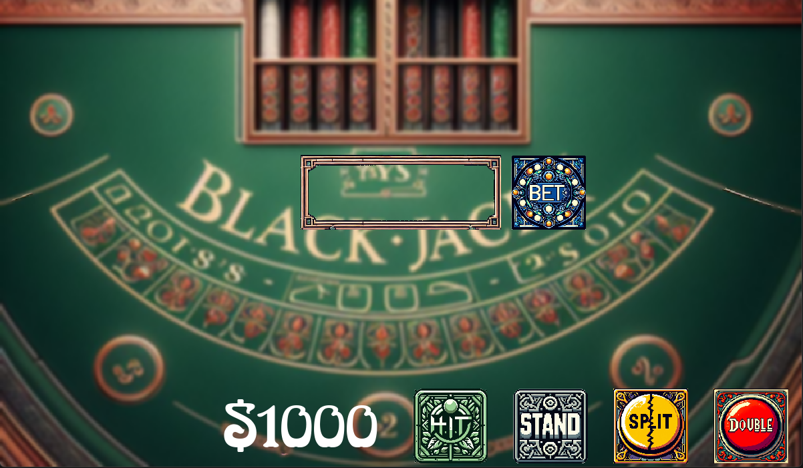
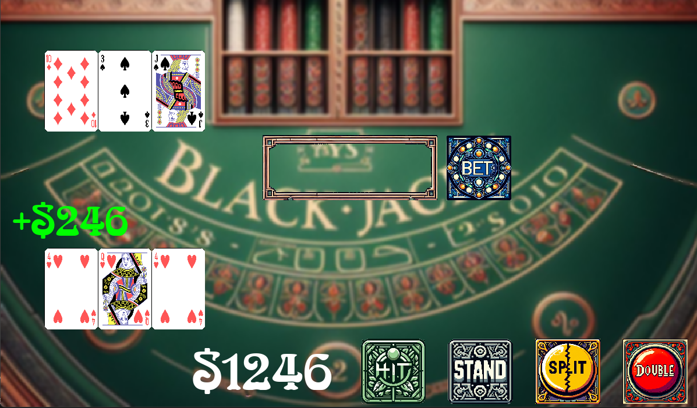
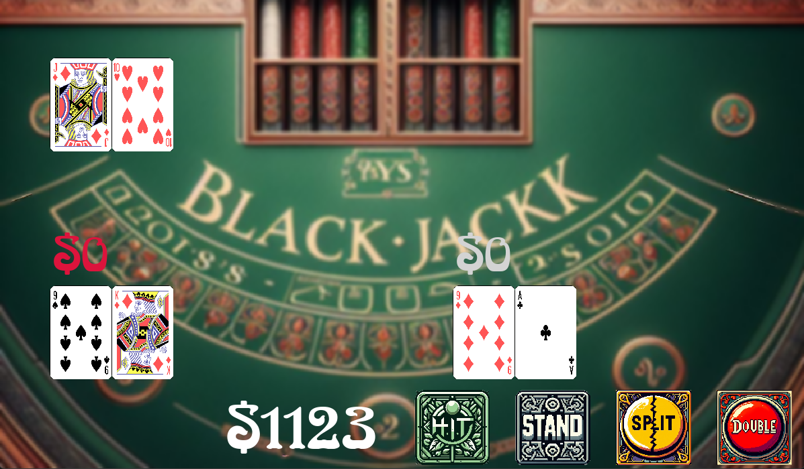

<h1>blackjack.py</h1>

  This started out as the first practical assignment in a Python Object-Oriented Programming class. There was nothing satisfying about playing blackjack in a terminal so I got in the mix with PyGame.

  You <i>can</i> play this in browser here: <a href="https://eoinmtreacy.github.io/blackjack/">https://eoinmtreacy.github.io/blackjack/</a>, but if you want a performant version I recommend running it locally.

<h2>Install</h2>
<ol>
  <li>Clone the repo</li>
  <li><code>pip install pygame</code></li>
  <li><code>python main.py</code></li>
</ol>

  Something to note: the version of the code served to the browser is actually from the <b>wasm</b> branch. This is due to some of the quirks associated with compiling PyGame to WebAssembly with Pygbag.

  These same quirks are what causes its performance to really suffer in browser. I wrote a blog post about what I learned about the process: 

